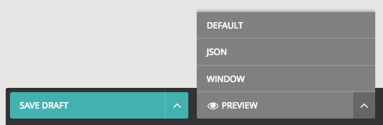

# Wagtail-preview

Alternative preview modes for Wagtail pages (for opinionated common usage).

* JSON
* Window



Goal is to provide a preview window which reloads on new drafts, kinda how `live reload` works (except than for content editors).

Resourcses

* https://developer.mozilla.org/en-US/docs/Web/API/Window/postMessage

## Status

* Proof of Concept
* Under development

## Installation

Install the package

```
pip install pip install git+https://github.com/moorinteractive/wagtail-preview.git
```

Add `wagtail-preview` to your `INSTALLED_APPS` settings and use the `PreviewMixin` mixin.

Make sure `wagtail.wagtailadmin` is set after `wagtail-preview`.

```python
# File settings.py

INSTALLED_APPS = [
    'wagtail-preview',

    'wagtail.wagtailforms',
    'wagtail.wagtailredirects',
    'wagtail.wagtailembeds',
    'wagtail.wagtailsites',
    'wagtail.wagtailusers',
    'wagtail.wagtailsnippets',
    'wagtail.wagtaildocs',
    'wagtail.wagtailimages',
    'wagtail.wagtailsearch',
    'wagtail.wagtailadmin',
    'wagtail.wagtailcore',

    'taggit',
    'modelcluster',

    'django.contrib.auth',
    'django.contrib.contenttypes',
    'django.contrib.sessions',
    'django.contrib.messages',
    'django.contrib.staticfiles',
]

# File models.py

from wagtail.wagtailcore.models import Page
from wagtailpreview.views import PreviewMixin

class MyPage(PreviewMixin, Page)
    pass

```
